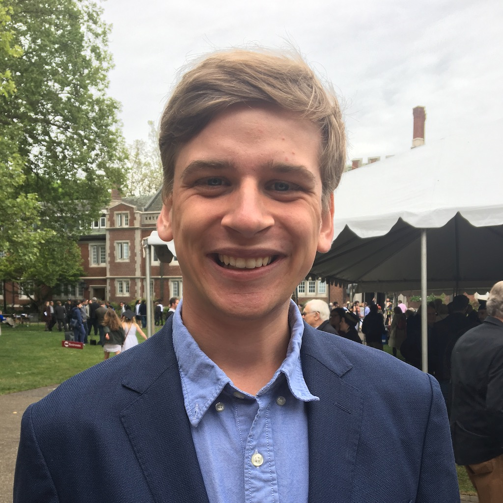

---
# You don't need to edit this file, it's empty on purpose.
# Edit theme's home layout instead if you wanna make some changes
# See: https://jekyllrb.com/docs/themes/#overriding-theme-defaults
layout: home
---

I am an economic historian and political economist, currently working as a predoc at Chicago Booth's Stigler Center for the Study of the Economy and the State. My research interests touch on:

- The impact of elite universities' admissions policies on social and economic mobility in the historical context.
- The Rust Belt's deindustrialization.
- How public money is used to bolster incumbents in local government.
- and more...

